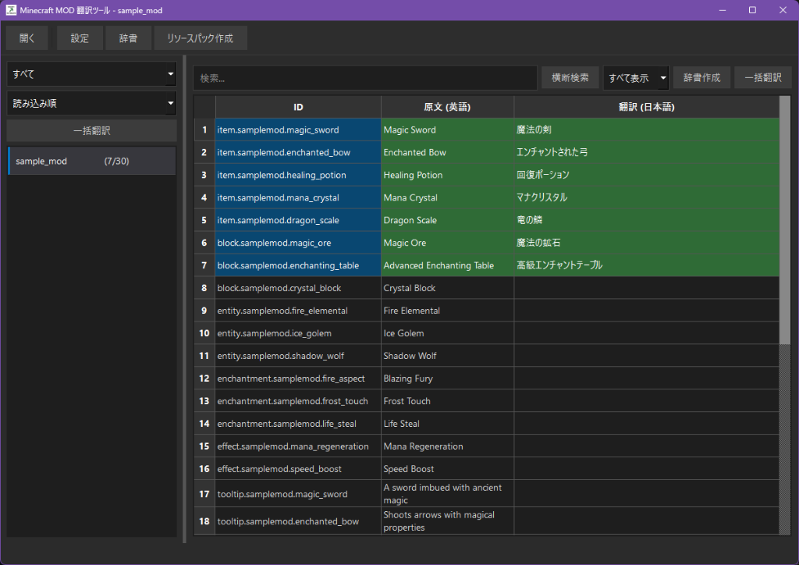

# MinecraftModTranslator

**Minecraft MOD/Modpackの日本語化を支援するデスクトップアプリケーション**

---

## スクリーンショット

---

## 概要

MinecraftModTranslatorは、Minecraft MODやModpackの翻訳作業を効率化するためのGUIツールです。

OpenRouter API経由でAI翻訳を行い、翻訳結果はリソースパック形式で出力されます。

## 主な機能

### MOD翻訳
- **JAR/ZIPファイル対応**: MODのJARファイルから言語ファイル（`en_us.json`）を自動読み込み
- **Minecraftディレクトリ対応**: `mods`フォルダ内のすべてのMODを一括読み込み
- **リソースパック出力**: 翻訳結果をリソースパックとして出力
- **既存翻訳のインポート**: リソースパックから既存の翻訳をインポート可能

### 翻訳
- **翻訳API**: OpenRouter APIのみ対応
- **翻訳言語**: 英語→日本語のみ対応
- **料金目安**: GPT-4o miniを使用して20万字翻訳で約18円

### その他機能
- **辞書**: カスタム辞書で固有名詞や専門用語の翻訳を統一
- **FTB Quests対応**

---

## ダウンロード

[Releases](https://github.com/TATUNOKO00122/MinecraftModTranslator/releases)から最新版のexeファイルをダウンロードしてください。

---

## 使い方

### 基本的な流れ

1. アプリケーションを起動
2. MOD/Modpackを読み込み
3. 設定でAPIキーを入力
4. 翻訳を実行
5. リソースパックとして出力

※Minecraftディレクトリを読み込むと、全てのMODとクエストが自動で検出されます。

### リソースパック出力

「リソースパック作成」ボタンで翻訳結果を出力します。出力されたリソースパックをMinecraftの`resourcepacks`フォルダに配置してください。

### FTB Questsの翻訳

翻訳自体はMODと同様ですが、SNBTファイルに翻訳キーを適用しないとリソースパックの翻訳が反映されません。
FTB Questsを翻訳する場合は、「SNBT適用」ボタンでSNBTファイルの変換を実行してください。

※原本のSNBTファイルは自動でバックアップされます。
